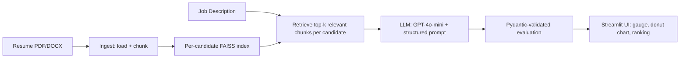

# 📄 AI Resume Screening Assistant

An AI-powered resume screening tool that evaluates candidate resumes against any job description using **LangChain**, **Retrieval-Augmented Generation (RAG)**, and **Streamlit**. Built as part of the GenAI & Agentic AI coursework at IIT Guwahati.

🔗 **Live App:** _[Add Streamlit Cloud link here]_

---

## Overview

Given a job description and one or more resumes (PDF or DOCX), the app:
- Retrieves the most relevant content from each resume using semantic search
- Uses an LLM to score the match, identify matching/missing skills, and give a structured, justified recommendation
- Supports single evaluation, multi-candidate comparison, and "best candidate" ranking
- Works with **any profession or job description** - not tied to a fixed set of job categories or keyword lists

The system was tested across two genuinely different domains (Radiation Therapy and Data Analytics) to confirm it generalizes rather than being tuned to one field. See [Testing](#testing) below.

---

## Architecture



**Key design decisions:**
- **One FAISS index per candidate**, rather than a single shared index with metadata filtering: this guarantees resumes never share retrieval context with each other, regardless of library version behavior.
- **Structured output via Pydantic** (`PydanticOutputParser`) - forces the LLM into a validated schema (score, matching/missing skills, strengths, weaknesses, recommendation, justification) rather than free-text.
- **`temperature=0`** on the LLM call for consistent, repeatable scores across runs on the same input.
- **Strict grounding prompt** - the LLM is instructed to score only against explicit JD requirements and never invent skills not present in the resume text.

---

## Tech Stack

| Component | Choice |
|---|---|
| LLM | OpenAI GPT-4o-mini |
| Embeddings | OpenAI `text-embedding-3-small` |
| Vector store | FAISS (in-memory, per-candidate) |
| Orchestration | LangChain |
| Structured output | Pydantic |
| UI | Streamlit |
| Charts | Plotly (gauge, donut, ranking bar) |
| Resume formats | PDF (`pypdf`), DOCX (`docx2txt`) |

---

## Project Structure

AI-Resume-Screening-Assistant/
├── app.py # Streamlit UI
├── screener/
│ ├── init.py
│ ├── ingest.py # Load PDF/DOCX, chunk, tag with candidate/page
│ ├── store.py # Embeddings + per-candidate FAISS retrieval
│ ├── schema.py # Pydantic schema for evaluation output
│ └── chain.py # Prompt template + LLM call + parsing
├── .streamlit/
│ └── config.toml # Theme config
├── requirements.txt
├── .gitignore
└── README.md


---

## Setup & Installation

**1. Clone the repo**
```bash
git clone https://github.com/Vineeth-Muraleedharan/AI-Resume-Screening-Assistant.git
cd AI-Resume-Screening-Assistant
```

**2. Create a virtual environment**
```bash
conda create -n resume-screener python=3.12
conda activate resume-screener
```

**3. Install dependencies**
```bash
pip install -r requirements.txt
```

**4. Add your OpenAI API key**

Create a `.env` file in the project root:

OPENAI_API_KEY=your_key_here


**5. Run the app**
```bash
streamlit run app.py
```

---

## Usage

1. Paste a job description into the **Job Description** box.
2. Upload one or more resumes (PDF or DOCX) - up to 5 files.
3. Choose a mode:
   - **Single / Compare** - evaluate one resume, or compare several side by side
   - **Best Candidate** - rank all uploaded resumes and highlight the top match
4. Click **Run Evaluation**.

Each result includes a match score gauge, a skill-coverage donut chart, matching/missing skills, strengths, weaknesses, and a justification grounded in the resume text.

---

## Testing

The pipeline was validated using two resumes for the same person in different domains - Radiation Therapy (RTT) and Data Analytics (DA) - cross-tested against JDs from both fields:

| Resume | RTT-focused JD | DA-focused JD |
|---|---|---|
| RTT resume | **95 - Strong Fit** | 10 - Not a Fit |
| DA resume | 30 - Not a Fit | **85 - Strong Fit** |

This confirms the system is genuinely JD-agnostic: each resume scores highly only against its own relevant domain, and the model correctly identifies partial overlaps (e.g., shared compliance knowledge) without inflating unrelated scores.

---

## Privacy Note

Uploaded resumes are processed in memory for the current session only and sent to OpenAI for analysis. Nothing is saved to disk or persisted between sessions.

---

## Author

**Vineeth Muraleedharan**
GitHub: [@Vineeth-Muraleedharan](https://github.com/Vineeth-Muraleedharan)
