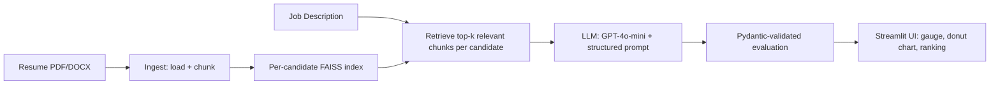

# 📄 AI Resume Screening Assistant

An AI-powered resume screening tool that evaluates candidate resumes against any job description using **LangChain**, **Retrieval-Augmented Generation (RAG)**, and **Streamlit**. Built as part of the GenAI & Agentic AI coursework at IIT Guwahati.

🔗 **Live App:** _[Add Streamlit Cloud link here]_

---

## Overview

Given a job description and one or more resumes (PDF or DOCX), the app:
- Retrieves the most relevant content from each resume using semantic search
- Uses an LLM to score the match, identify matching/missing skills, and give a structured, justified recommendation
- Supports single evaluation, multi-candidate comparison, and "best candidate" ranking
- Works with **any profession or job description** - not tied to a fixed set of job categories or keyword lists

The system was tested across two genuinely different domains (Radiation Therapy and Data Analytics) to confirm it generalizes rather than being tuned to one field. See [Testing](#testing) below.

---

## Architecture

**Key design decisions:**
- **One FAISS index per candidate**, rather than a single shared index with metadata filtering: this guarantees resumes never share retrieval context with each other, regardless of library version behavior.
- **Structured output via Pydantic** (`PydanticOutputParser`) - forces the LLM into a validated schema (score, matching/missing skills, strengths, weaknesses, recommendation, justification) rather than free-text.
- **`temperature=0`** on the LLM call for consistent, repeatable scores across runs on the same input.
- **Strict grounding prompt** - the LLM is instructed to score only against explicit JD requirements and never invent skills not present in the resume text.

---

## Tech Stack

| Component | Choice |
|---|---|
| LLM | OpenAI GPT-4o-mini |
| Embeddings | OpenAI `text-embedding-3-small` |
| Vector store | FAISS (in-memory, per-candidate) |
| Orchestration | LangChain |
| Structured output | Pydantic |
| UI | Streamlit |
| Charts | Plotly (gauge, donut, ranking bar) |
| Resume formats | PDF (`pypdf`), DOCX (`docx2txt`) |

---

## Project Structure
